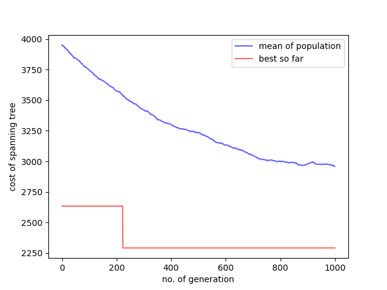

# dc-mst-hssga

This repository is a third-party implementation of [A hybrid genetic algorithm for the degree-constrained minimum spanning tree problem](https://doi.org/10.1007/S00500-019-04051-X).

# Requirements

- python 3.8.3

# Getting Started

Open dc_mst_ga.py and run the example code.

Given an adjacency matrix

<a href="https://www.codecogs.com/eqnedit.php?latex=A=\left[\begin{array}{ccccccccc}&space;0&space;&&space;224&space;&&space;224&space;&&space;361&space;&&space;671&space;&&space;300&space;&&space;539&space;&&space;800&space;&&space;943&space;\\&space;224&space;&&space;0&space;&&space;200&space;&&space;200&space;&&space;447&space;&&space;283&space;&&space;400&space;&&space;728&space;&&space;762&space;\\&space;224&space;&&space;200&space;&&space;0&space;&&space;400&space;&&space;566&space;&&space;447&space;&&space;600&space;&&space;922&space;&&space;949&space;\\&space;361&space;&&space;200&space;&&space;400&space;&&space;0&space;&&space;400&space;&&space;200&space;&&space;200&space;&&space;539&space;&&space;583&space;\\&space;671&space;&&space;447&space;&&space;566&space;&&space;400&space;&&space;0&space;&&space;600&space;&&space;447&space;&&space;781&space;&&space;510&space;\\&space;300&space;&&space;283&space;&&space;447&space;&&space;200&space;&&space;600&space;&&space;0&space;&&space;283&space;&&space;500&space;&&space;707&space;\\&space;539&space;&&space;400&space;&&space;600&space;&&space;200&space;&&space;447&space;&&space;283&space;&&space;0&space;&&space;361&space;&&space;424&space;\\&space;800&space;&&space;728&space;&&space;922&space;&&space;539&space;&&space;781&space;&&space;500&space;&&space;361&space;&&space;0&space;&&space;500&space;\\&space;943&space;&&space;762&space;&&space;949&space;&&space;583&space;&&space;510&space;&&space;707&space;&&space;424&space;&&space;500&space;&&space;0&space;\end{array}\right]" target="_blank"></a>

and a degree constraint .

We can find the exact solution shown below.

# License

MIT

# Acknowledgments

- UCAS course: Intelligent Optimization Methods [070105M05002H](http://jwxk.ucas.ac.cn/course/courseplan/184399)

高哥